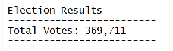
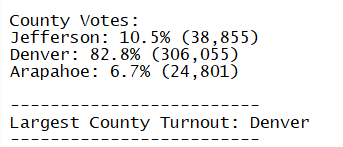
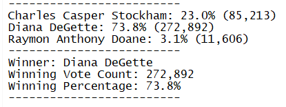

# Election Analysis

## Overview of Election Audit
An audit was conducted of a recent election of a congressional precinct that includes Arapahoe, Jefferson and Denver Counties. 

### Purpose
The purpose of this analysis is to assist the board of elections with the certification of an election audit in the state of Colorado.  The analysis summarizes the results of the audit for one district within the state.

This analysis was initiated to understand if auditing election results could be automated and utilized for other precincts, senate and local elections within the state.  They are also looking to see if the audit process can be improved.

### Election-Audit Results
There are a total of 369,711 votes cast in the reviewed election.  

As seen below, the majority of the votes were cast in Denver County with 82.8%.  The remaining counties saw a very small portion of the votes with Jefferson County at 10.5% and Arapahoe at 6.7%.

There are three candidates in the audit, DeGette, Stockham, and Doan.  DeGette received the majority of the popular vote with 73.8% of the votes, or 272,892 votes.  The remaining two candidates received a combined 26.1% of the votes.
	

### Election-Audit Summary
In summary, this process is easy enough to audit the data.  It gives a quick and simple way to look at the data from a high level.  The code is written in such a way that it is not dependent on updating the counties or districts to fit the data set of voters being analyzed, only the naming convention and location of the data set file.  

Two proposed modifications:
1.	Write the code so that it is not dependent on where the data is saved.
2.	Write the code is such a way that it is not dependent on the naming convention of the file where the data set is saved.

#### Additional Analysis is Needed
It is unknown if there was an analysis completed on how the votes were collected and entered into the system for analysis.  This type of analysis is critical to the validity of the audit and should be done in conjunction with the data analysis.

It is also recommended that this process be used in conjunction with current auditing processes so that it can be tested for confidence levels over time.